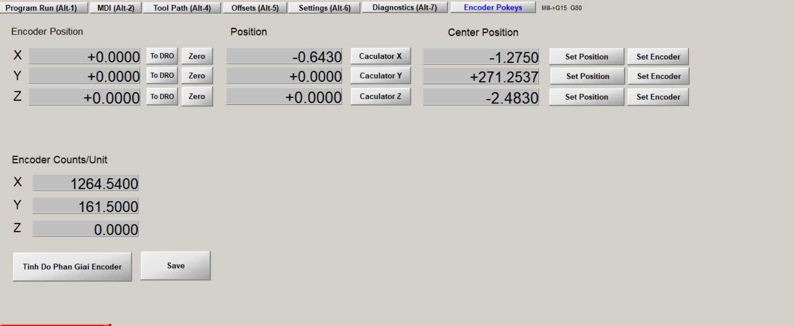

# Giao diện Encoder cho việc giao tiếp giữa mach3 và pokeys

- Tính toán độ phân giải encoder và lưu lại.
- Hiển thị vị trí encoder.
- Button set 0 cho encoder và chuyển vị trí encoder vô vị trí máy.
- Tính toạ độ điểm giữa của toạ độ hiện tại so với vị trí 0. Set góc 0 lại toạ độ giữa và update vị trí encoder.

